<!-- Bannière animée générée par scripts/banniere.py : modifier le nom et les rôles dans ce script -->
<picture>
  <source media="(prefers-color-scheme: dark)" srcset="assets/banniere-sombre.svg">
  
</picture>

## 👋 À propos de moi

<!-- ✏️ Valeurs d'exemple : remplacer par votre propre présentation -->

Data Analyst et Data Engineer, j'aime transformer des données brutes en informations utiles : collecte, nettoyage, modélisation, puis mise à disposition dans des applications simples à utiliser.

## 🛠️ Compétences

<table>
  <tr>
    <td><b>Data & machine learning</b></td>
    <td>
      
      
      
      
      
      
      
      
      
      
    </td>
  </tr>
  <tr>
    <td><b>Bases de données</b></td>
    <td>
      
      
      
    </td>
  </tr>
  <tr>
    <td><b>Applications & web</b></td>
    <td>
      
      
      
      
      
    </td>
  </tr>
  <tr>
    <td><b>Cloud & DevOps</b></td>
    <td>
      
      
      
      
      
      
    </td>
  </tr>
  <tr>
    <td><b>Outils</b></td>
    <td>
      
      
    </td>
  </tr>
</table>

## 📊 Statistiques GitHub

<!-- Cartes mises à jour chaque jour par la GitHub Action « Statistiques GitHub » (scripts/statistiques.py) -->

  <picture>
    <source media="(prefers-color-scheme: dark)" srcset="assets/stats-sombre.svg">
    
  </picture>
  <picture>
    <source media="(prefers-color-scheme: dark)" srcset="assets/langages-sombre.svg">
    
  </picture>

