<!-- Bannière animée générée par scripts/banniere.py : modifier le nom et les rôles dans ce script -->
<picture>
  <source media="(prefers-color-scheme: dark)" srcset="assets/banniere-sombre.svg">
  
</picture>

<!-- Terminal animé généré par scripts/terminal.py : modifier les phrases dans ce script -->
<picture>
  <source media="(prefers-color-scheme: dark)" srcset="assets/terminal-sombre.svg">
  
</picture>

## 👋 À propos de moi

Data Analyst et Data Engineer, j'aime transformer des données brutes en informations utiles : collecte, nettoyage, modélisation, puis mise à disposition dans des applications simples à utiliser.

- ☕ **Carburant** : café et logs propres
- 🐛 **Dernier bug mémorable** : un fuseau horaire, évidemment
- 🧹 **Passe-temps caché** : nettoyer des CSV que personne n'ose ouvrir
- 🎯 **Quête actuelle** : un poste de Data Engineer

## 🧙 Fiche personnage

<!-- ✏️ Jauges sur 5 : ajuster les ▰ (remplis) et ▱ (vides) selon votre ressenti -->

<table>
  <tr>
    <td>

| | |
|---|---|
| 🧙 **Classe** | Data Engineer, multiclassé Data Analyst |
| ⚔️ **Arme favorite** | pandas |
| 🛡️ **Armure** | Tests unitaires et CI |
| 🧪 **Potion** | Café serré |
| 🐉 **Boss vaincu** | Le fichier Excel aux cellules fusionnées |
| 💀 **Point faible** | Les fuseaux horaires |

</td>
    <td>

| Caractéristique | Niveau |
|---|---|
| 🐍 Python | ▰▰▰▰▰ |
| 🗄️ SQL | ▰▰▰▰▱ |
| ☁️ Cloud Azure | ▰▰▰▰▱ |
| 📊 Dataviz | ▰▰▰▱▱ |
| 🌙 Débogage à 2 h du matin | ▰▰▰▰▰ |

</td>
  </tr>
</table>

## 🚀 Projets phares

Cliquez sur un projet pour le déplier.

<b>💧 Qualité de l'eau potable en France</b> : pipeline médaillon sur Azure et Databricks

 

Collecte des résultats du contrôle sanitaire de l'eau potable (2021 à 2025, data.gouv.fr), stockage dans **Azure** et transformation avec **Databricks** selon une architecture médaillon (bronze, silver, gold), jusqu'à un modèle en étoile prêt pour l'analyse. Tests et CI inclus.

👉 [brief_qualite_eau_france](https://github.com/Olaffson/brief_qualite_eau_france)

<b>🚗 Estimation du prix d'une voiture</b> : du nettoyage des données à l'application Streamlit

 

Nettoyage des données, entraînement d'une forêt aléatoire avec **scikit-learn** et application **Streamlit** pour estimer le prix d'un véhicule. En cours : suivi du drift et réentraînement automatique, testés sur des données simulées.

👉 [prix_voiture](https://github.com/Olaffson/prix_voiture)

<b>⚡ Consommation électrique des Hauts-de-France</b> : prévision de séries temporelles

 

Analyse et prévision de la consommation électrique quotidienne (données RTE) : modèles statistiques (ARIMA, SARIMA, VARIMA), modèles de référence et apprentissage automatique (XGBoost, Prophet), le tout présenté dans une application **Streamlit**.

👉 [time_series](https://github.com/Olaffson/time_series)

<b>🚲 Adventure Works</b> : SQL Server, Docker, Azure et tableau de bord

 

Reprise d'un projet BI : restauration des bases OLTP et datawarehouse **SQL Server**, requêtes SQL pour l'équipe BI, images **Docker** déployées sur **Azure Container Instances** et tableau de bord **Streamlit** pour la direction.

👉 [adventure_works](https://github.com/Olaffson/adventure_works)

<b>🎬 Top 250 IMDb</b> : scraping, MongoDB et Streamlit

 

Récupération des films et séries du top 250 d'IMDb avec **Scrapy**, stockage dans **MongoDB Atlas**, analyses avec pymongo et application **Streamlit** de recherche.

👉 [Scraping_MongoDB_Streamlit](https://github.com/Olaffson/Scraping_MongoDB_Streamlit)

## 🛠️ Compétences

<table>
  <tr>
    <td><b>Data & machine learning</b></td>
    <td>
      
      
      
      
      
      
      
      
      
      
    </td>
  </tr>
  <tr>
    <td><b>Bases de données</b></td>
    <td>
      
      
      
    </td>
  </tr>
  <tr>
    <td><b>Applications & web</b></td>
    <td>
      
      
      
      
      
    </td>
  </tr>
  <tr>
    <td><b>Cloud & DevOps</b></td>
    <td>
      
      
      
      
      
      
    </td>
  </tr>
  <tr>
    <td><b>Outils</b></td>
    <td>
      
      
    </td>
  </tr>
</table>

## 📊 Statistiques GitHub

<!-- Cartes mises à jour chaque jour par la GitHub Action « Statistiques GitHub » (scripts/statistiques.py) -->

  <picture>
    <source media="(prefers-color-scheme: dark)" srcset="assets/stats-sombre.svg">
    
  </picture>
  <picture>
    <source media="(prefers-color-scheme: dark)" srcset="assets/langages-sombre.svg">
    
  </picture>

